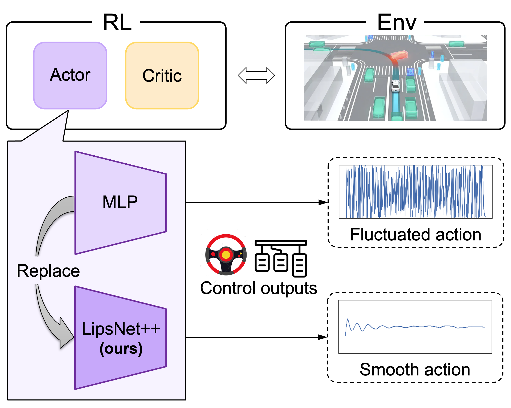
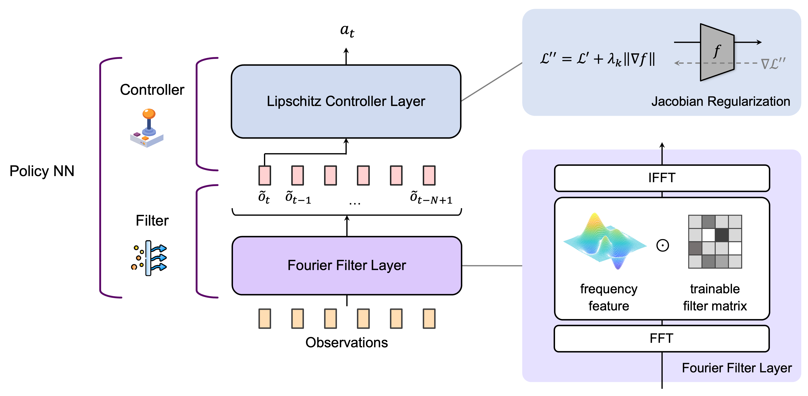

# LipsNet++

The paper is accepted at **ICML 2025** as **Spotlight** with the title '***LipsNet++: Unifying Filter and Controller into a Policy Network***'.

Links: [[**Paper**](https://openreview.net/pdf?id=KZo2XhcSg6)], [[**Poster**](https://github.com/xjsong99/LipsNet_v2/blob/main/materials/Poster.pdf)], [[**Website**](https://xjsong99.github.io/LipsNet_v2/)].



LipsNet++ is the upgraded version of [LipsNet](https://github.com/xjsong99/LipsNet) (*Song, ICML 2023*).  
It can serve as **policy networks** in most **actor-critic RL** algorithms to reduce the action fluctuation.  
A low level of action fluctuation will protect mechanical components from the wear and tear, and reduce safety hazards.

The overall structure is shown below:



## Requirements
The **version of PyTorch** should be higher than 1.11 and lower than 2.3,
as we incorporate *functorch.jacrev* and *functorch.vmap* methods.

## How to use
We package LipsNet++ as a **PyTorch module**.
The code is availabel in [LipsNet++.py](https://github.com/xjsong99/LipsNet_v2/blob/master/LipsNet++.py).

Users can **easily use** it just like using an MLP and **easily replace** your policy network by LipsNet++.

```
from lipsnet++ import LipsNet_v2

# declare
net = LipsNet_v2(...)

# training
net.train()
out = net(input)
...
loss.backward()
optimizer.step()
optimizer.zero_grad()
net.eval()

# evaluation
net.eval()
out = net(input)
```

More details can be found in [LipsNet++.py](https://github.com/xjsong99/LipsNet_v2/blob/master/LipsNet++.py).

## Reference
```
@inproceedings{lipsnet_v2,
        title={LipsNet++: Unifying Filter and Controller into a Policy Network},
        author={Song, Xujie and Chen, Liangfa and Liu, Tong and Wang, Wenxuan and Wang, Yinuo and Qin, Shentao and Ma, Yinsong and Duan, Jingliang and Li, Shengbo Eben},
        booktitle={International Conference on Machine Learning},
        year={2025},
        organization={PMLR}
}
```